 

# order-service 

### 주문 요청 
- 요청: 상품 주문 
- Method: POST
- URL: http:<hello>//127.0.0.1:8000/order-service/[사용자 아이디]/orders
- Request Body: 
~~~
{
    "productId": "CATALOG-0002",
    "qty": 10,
    "unitPrice": 900
}
~~~
- Response Body:
~~~
{
    "productId": "CATALOG-0002",
    "qty": 10,
    "unitPrice": 900,
    "totalPrice": 9000,
    "orderId": "868b506a-1925-4410-a68d-4e06d7241a6b"
}
~~~

### 주문 내역 조회 
- 요청: 상품 주문 내역 조회 
- Method: GET
- URL: http:<hello>//127.0.0.1:8000/order-service/[사용자 아이디]/orders
- Response Body:
~~~
[
    {
        "productId": "CATALOG-0007",
        "qty": 10,
        "unitPrice": 900,
        "totalPrice": 9000,
        "createdAt": "2022-07-29T17:00:27.025+00:00",
        "orderId": "4f06ef6a-5d84-4f1e-9765-627b386b184b"
    },
    {
        "productId": "CATALOG-0009",
        "qty": 10,
        "unitPrice": 900,
        "totalPrice": 9000,
        "createdAt": "2022-07-29T17:00:36.731+00:00",
        "orderId": "bb0bd2e9-2265-4854-9c37-8045bc63d6b7"
    }
]
~~~
  

# Multiple Orders Service 
user-service 요청 처리의 부하 분산을 위해  
order-service를 하나 이상 기동한다고 가정했을 때  
order-service 데이터가 분산 저장되어 동기화 문제가 발생한다.  

> 예를 들어 order-service를 2개 기동한 후  
> 한 사용자가 3번 주문을 해서  
> 첫번째 order-service에는 1개의 주문내역,  
> 두번째 order-service에는 2개의 주문내역이 저장되었을 경우  
> 같은 사용자임에도 불구하고 주문내역을 조회할 때  
> 어떤 경우에는 조회 결과가 1개, 어떤 경우에는 2개로 조회 결과가 나오게 된다.  

## 해결 방법?
- 하나의 데이터베이스 사용 
- 데이터베이스 간의 동기화 
    - Message Queuing Server 사용 (Apache Kafka, RabbitMQ)  
    한쪽에 새로 업데이트 된 데이터를 Message Queuing Server로 전달  
    다른쪽 서비스는 Message Queuing Server로 구독 신청(변경된 데이터가 있으면 알려줌.)을 해서  
    변경된 데이터를 가져와서 자신의 데이터베이스에도 업데이트.  
- Kafka Connector + DB
    - Message Queuing Server와 하나의 데이터베이스 사용. 
    - Message Queuing Server에 데이터를 전달한 후  
    Message Queuing Server에서 데이터베이스에 업데이트.
    - 많은 요청 처리 시 동시성 문제를 Kafka에 일임. 

  
    
# Apache Kafka
- Apache Software Foundation 의 Scalar 언어로 된 오픈 소스 메시지 브로커 프로젝트 
- Linked-in 에서 개발, 2011년 오픈 소스화 
    - 2014년 11월 링크드인에서 Kafka를 개발하던 엔지니어들이 Kafka 개발에 집중하기 위해 Confluent 라는 회사 창립 
- 실시간 데이터 피드를 관리하기 위해 통일된 높은 처리량, 낮은 지연 시간을 지닌 플랫폼 제공

## Kafka Broker
- 실행 된 Kafka 애플리케이션 서버
- 3대 이상의 Broker Cluster 구성 권장 
- Zookeeper 연동 
    - Broker Cluster 서버들을 관리해 주는 코디네이터 역할 (~~동물원 사육사~~)
    - 메타데이터 (Broker ID, Controller ID 등) 저장
    - Controller 정보 저장 
- n개 Broker 중 1대는 Controller 기능 수행 
    - Controller 역할
        - 각 Broker에게 담당 파티션 할당 수행 
        - Broker 정상 동작 모니터링 관리 
 

# Ecosystem 1. Kafka Client
- https://docs.confluent.io/platform/current/clients/index.html
- Kafka 와 데이터를 주고 받기 위해 사용하는 Java Library
    - https://mvnrepository.com/artifact/org.apache.kafka/kafka-clients
- Producer, Consumer, Admin, Stream 등 Kafka 관련 API 제공
- 다양한 3rd party library 존재 (C/C++, Node.js, Python, .NET 등)
    - https://cwiki.apache.org/confluence/display/kafka/clients

## Kafka 설치
https://kafka.apache.org 에서 다운로드 받은 후 압축 해제.

## Kafka 서버 기동
### Zookeeper 및 Kafka 서버 구동
~~~
$KAFKA_HOME/bin/zookeeper-server-start.sh $KAFKA_HOME/config/zookeeper.properties
$KAFKA_HOME/bin/kafka-server-start.sh $KAFKA_HOME/config/server.properties
~~~
producer 들이 메시지를 생성해서 보내게 되면 Topic 에 저장이 된다.  
새로운 메시지는 Topic 에 등록한 consumer 에게 전달된다.   
### Topic 생성 
~~~
$KAFKA_HOME/bin/kafka-topics.sh --create --topic quickstart-events --bootstrap-server localhost:9092 --partitions 1
    => --create 옵션을 사용하여 quickstart-events 이름으로 토픽을 생성. 
~~~
### Topic 목록 확인
~~~
$KAFKA_HOME/bin/kafka-topics.sh --bootstrap-server localhost:9092 --list
~~~
### Topic 정보 확인
~~~
$KAFKA_HOME/bin/kafka-topics.sh --describe --topic quickstart-events --bootstrap-server localhost:9092
~~~

## Kafka Producer/Consumer 테스트 
### 메시지 생산 
~~~
$KAFKA_HOME/bin/kafka-console-producer.sh --broker-list localhost:9092 --topic quickstart-events 
~~~
### 메시지 소비 
~~~
$KAFKA_HOME/bin/kafka-console-consumer.sh --bootstrap-server localhost:9092 --topic quickstart-events --from-beginning 
~~~
#### [테스트 결과] 
 
 
  

# Ecosystem 2. Kafka Connect
- Kafka Connect를 통해 Data를 Import/Export 가능  
- 코드 없이 Configuration으로 데이터를 이동  
- Standalone mode, Distribution mode 지원  
    - RESTful API 통해 지원  
    - Stream 또는 Batch 형태로 데이터 전송 가능  
    - 커스텀 Connector를 통한 다양한 Plugin 제공 (File, S3, Hive, Mysql 등)  

        > Source System (Hive, jdbc..)  
        >  -> Kafka Connect Source  
        >  -> Kafka Cluster  
        >  -> Kafka Connect Sink  
        >  -> Target System (S3..) 

## Kafka 를 이용한 데이터베이스 동기화 테스트 
#### [pom.xml]
~~~
<!--<dependency>
    <groupId>org.mariadb.jdbc</groupId>
    <artifactId>mariadb-java-client</artifactId>
    <version>2.7.2</version>
</dependency>-->
<dependency>
    <groupId>mysql</groupId>
    <artifactId>mysql-connector-java</artifactId>
    <version>8.0.30</version>
</dependency>
~~~
#### [테스트용 테이블 생성] 
~~~
create table users (
    id int auto_increment primary key,
    user_id varchar(20) null,
    pwd varchar(20) null,
    name varchar(20) null,
    created_at datetime default CURRENT_TIMESTAMP null
);
~~~
### Kafka Connect 설치
~~~
curl -O http://packages.confluent.io/archive/5.5/confluent-community-5.5.2-2.12.tar.gz
curl -O http://packages.confluent.io/archive/6.1/confluent-community-6.1.0.tar.gz
tar xvf confluent-community-6.1.0.tar.gz
cd $KAFKA_CONNECT_HOME
~~~
### Kafka Connect 설정 
(현재는 기본으로 사용)  
~~~
$KAFKA_HOME/config/connect-distributed.properties
~~~
### Kafka Connect 실행 
~~~
$KAFKA_CONNECT_HOME/bin/connect-distributed $KAFKA_CONNECT_HOME/etc/kafka/connect-distributed.properties
~~~
 

Kafka Connect 를 실행한 후 Topic 목록을 확인하면 아래와 같이 디폴트로 생성되는 토픽들을 확인할 수 있다.  

 

### JDBC Connector 설치
https://docs.confluent.io/5.5.1/connect/kafka-connect-jdbc/index.html 에서  
confluentinc-kafka-connect-jdbc-10.5.1.zip 파일을 다운로드 받은 후 압축 해제.  

$KAFKA_CONNECT_HOME/etc/kafka/connect-distributed.properties 파일에  
plugin 옵션으로 JDBC Connector 경로를 추가한다.  
~~~
plugin.path=/Users/sombrero104/workspace/confluentinc-kafka-connect-jdbc-10.5.1/lib
~~~

로컬 리파지토리 경로에 있는 mysql 드라이버를  
(/mysql/mysql-connector-java/8.0.30/mysql-connector-java-8.0.30.jar)  
Kafka 커넥터의 ./confluent-6.1.0/share/java/kafka/ 경로에 복사해 준다.  

### Kafka Source Connect 등록 
POST 방식으로 /connectors 호출. 
~~~
echo '
{
    "name" : "my-source-connect",
    "config" : {
        "connector.class" : "io.confluent.connect.jdbc.JdbcSourceConnector",
        "connection.url":"jdbc:mysql://localhost:3306/mydb",
        "connection.user":"root",
        "connection.password":"패스워드",
        "mode": "incrementing",                     // 자동 증가 방식.
        "incrementing.column.name" : "id",          // 자동 증가 컬럼. 
        "table.whitelist":"users",                  // 이 테이블의 변경 사항을 감지. 
        "topic.prefix" : "my_topic_",               // 변경 내용을 이 prefix를 가진 토픽에 저장. (my_topic_users가 된다.) 
        "tasks.max" : "1"
    }
}
' | curl -X POST -d @- http://localhost:8083/connectors --header "content-Type:application/json"
~~~

### Kafka Connect 목록 확인
GET 방식으로 /connectors 호출.  
현재 등록되어진 connector 들을 확인할 수 있다.  
~~~
curl http://localhost:8083/connectors
~~~

### Kafka Connect 확인 
GET 방식으로 /connectors/[connector 이름]/status 호출.  
현재 등록되어진 connector 의 상세 정보를 확인할 수 있다.  
~~~
curl http://localhost:8083/connectors/my-source-connect/status 
~~~

### 테스트를 위해 Kafka Consumer 를 실행 
~~~ 
$KAFKA_HOME/bin/kafka-console-consumer.sh --bootstrap-server localhost:9092 --topic my_topic_users --from-beginning 
~~~
 

위와 같이 Consumer 를 띄우면 users 테이블에 변경사항이 발생함과 동시에 아래와 같이 출력되는 것을 확인할 수 있다.  

 

~~~
{
    "schema":{
	    "type":"struct"
		,"fields":[
			{"type":"int32","optional":false,"field":"id"}
			,{"type":"string","optional":true,"field":"user_id"}
			,{"type":"string","optional":true,"field":"pwd"}
			,{"type":"string","optional":true,"field":"name"}
			,{"type":"int64","optional":true,"name":"org.apache.kafka.connect.data.Timestamp","version":1,"field":"created_at"}
		]
		,"optional":false
		,"name":"users"
	}
	,"payload":{"id":1,"user_id":"test1","pwd":null,"name":"test1","created_at":1660592867000}
}
~~~
 출력된 포맷은 카프카가 토픽으로 전달할 때 자동으로 생성한 포맷으로  
토픽을 이용하여 데이터베이스에 데이터를 저장하기 위해서는 위와 같은 포맷으로 전달하면 된다.  
데이터베이스에 직접 저장하지 않고 토픽에 저장하면 Sink Connect 에 의해 데이터베이스에 저장이 되게 된다.  

### Kafka Sink Connect 등록 
POST 방식으로 /connectors 호출.  
(Source Connect 와 같은 API 를 호출하지만 connector.class 가 다르다.)  
Source Connect 에서 전달한 데이터가 Topic 에 쌓이고 Sink Connect 가 가져와서 사용한다.  
~~~
echo '
{
    "name":"my-sink-connect",
    "config":{
        "connector.class":"io.confluent.connect.jdbc.JdbcSinkConnector", // DB 연결용 Sink Connector를 사용. 
        "connection.url":"jdbc:mysql://localhost:3306/mydb",
        "connection.user":"root",
        "connection.password":"패스워드",
        "auto.create":"true",           // Topic의 이름(현재는 my_topic_users)과 같은 이름의 테이블을 자동으로 생성하는 옵션. 
        "auto.evolve":"true",
        "delete.enabled":"false",
        "tasks.max":"1",
        "topics":"my_topic_users"       // 데이터를 가져올 Topic. 
    }
}
'| curl -X POST -d @- http://localhost:8083/connectors --header "content-Type:application/json"
~~~
 
 

호출 결과 (위에서 users 테이블에 insert 발생 후) Topic 에서 전달된  
데이터가 저장된 my_topic_users 테이블이 생성된 것을 확인할 수 있다.  

 

이후에도 users 테이블에 새로운 데이터를 insert 하면 my_topic_users 에도 똑같이 저장되는 것을 확인할 수 있다.  

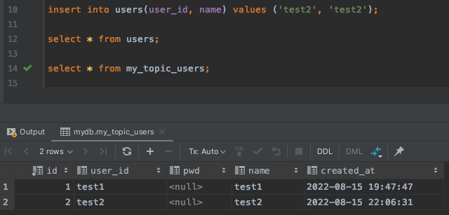 

만약, users 테이블에 insert 하지 않고 Producer 로 Topic 에 데이터를 전달하게 되면  
users 테이블에는 저장하지 않고 Topic 을 통하여 바로 my_topic_users 테이블에만 저장하게 된다.  
(Sink Connect 만 사용하게 된다.)  

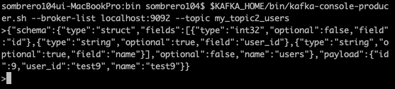 
  

## Kafka 를 이용한 데이터베이스 동기화를 서비스에 적용 
- order-service 에 요청 된 주문의 수량 정보를 catalog-service 에 반영.
    - order-service 와 catalog-service 는 다른 DB 사용 중.
- order-service 에서 Kafka Topic 으로 메시지 전송. 
    - order-service 가 Producer 역할. 
- catalog-service 에서 Kafka Topic 에 전송된 메시지 취득. 
    - catalog-service 가 Consumer 역할.  

### catalog-service 에 Consumer 설정 
#### [catalog-service - pom.xml]
~~~
<dependency>
    <groupId>org.springframework.kafka</groupId>
    <artifactId>spring-kafka</artifactId>
</dependency>
~~~
#### [catalog-service - KafkaConsumerConfig.java] 
~~~
@EnableKafka
@Configuration
public class KafkaConsumerConfig {
    @Bean
    public ConsumerFactory<String, String> consumerFactory() {
        Map<String, Object> properties = new HashMap<>();
        properties.put(ConsumerConfig.BOOTSTRAP_SERVERS_CONFIG, "172.18.0.101:9092"); // Kafka Server 주소
        properties.put(ConsumerConfig.GROUP_ID_CONFIG, "consumerGroupId");
        properties.put(ConsumerConfig.KEY_DESERIALIZER_CLASS_CONFIG, StringDeserializer.class);
        properties.put(ConsumerConfig.VALUE_DESERIALIZER_CLASS_CONFIG, StringDeserializer.class);
        /* Topic 에 저장되는 데이터 형식인 JSON(Key 와 Value 형태) 을
           원래 형태로 Deserialize 한 후 사용하는데 전달하는 방식이 String 형식이어서 StringDeserializer 사용. */
        return new DefaultKafkaConsumerFactory<>(properties);
    }

    @Bean
    public ConcurrentKafkaListenerContainerFactory<String, String> kafkaListenerContainerFactory() {
        ConcurrentKafkaListenerContainerFactory<String, String> kafkaListenerContainerFactory
                = new ConcurrentKafkaListenerContainerFactory<>();
        kafkaListenerContainerFactory.setConsumerFactory(consumerFactory());
        return kafkaListenerContainerFactory;
    }
}
~~~
#### [catalog-service - KafkaConsumer.java] 
~~~
@Service
@Slf4j
public class KafkaConsumer {
    CatalogRepository repository;

    @Autowired
    public KafkaConsumer(CatalogRepository repository) {
        this.repository = repository;
    }

    /**
     * example-catalog-topic 이름을 가진 Kafka Topic 의 변경 사항을 감지하여 DB 에 동기화.
     */
    @KafkaListener(topics = "example-catalog-topic")
    public void updateQty(String kafkaMessage) {
        log.info("Kafka Message: ->" + kafkaMessage);

        Map<Object, Object> map = new HashMap<>();
        ObjectMapper mapper = new ObjectMapper();
        try {
            map = mapper.readValue(kafkaMessage, new TypeReference<Map<Object, Object>>() {});
        } catch (JsonProcessingException ex) {
            ex.printStackTrace();
        }

        CatalogEntity entity = repository.findByProductId((String)map.get("productId"));
        if (entity != null) {
            entity.setStock(entity.getStock() - (Integer)map.get("qty"));
            repository.save(entity);
        }
    }
}
~~~

### order-service 에 Producer 설정 
#### [order-service - pom.xml]
~~~
<dependency>
    <groupId>org.springframework.kafka</groupId>
    <artifactId>spring-kafka</artifactId>
</dependency>
~~~
#### [order-service - KafkaProducerConfig.java]
~~~
@EnableKafka
@Configuration
public class KafkaProducerConfig {
    @Bean
    public ProducerFactory<String, String> producerFactory() {
        Map<String, Object> properties = new HashMap<>();
        properties.put(ProducerConfig.BOOTSTRAP_SERVERS_CONFIG, "127.0.0.1:9092");
        properties.put(ProducerConfig.KEY_SERIALIZER_CLASS_CONFIG, StringSerializer.class);
        properties.put(ProducerConfig.VALUE_SERIALIZER_CLASS_CONFIG, StringSerializer.class);
        return new DefaultKafkaProducerFactory<>(properties);
    }

    @Bean
    public KafkaTemplate<String, String> kafkaTemplate() {
        return new KafkaTemplate<>(producerFactory());
    }
}
~~~
#### [order-service - KafkaProducer.java]
~~~
@Service
@Slf4j
public class KafkaProducer {
    private KafkaTemplate<String, String> kafkaTemplate;

    @Autowired
    public KafkaProducer(KafkaTemplate<String, String> kafkaTemplate) {
        this.kafkaTemplate = kafkaTemplate;
    }

    public OrderDto send(String topic, OrderDto orderDto) {
        ObjectMapper mapper = new ObjectMapper();
        String jsonInString = "";
        try {
            jsonInString = mapper.writeValueAsString(orderDto);
        } catch(JsonProcessingException ex) {
            ex.printStackTrace();
        }

        kafkaTemplate.send(topic, jsonInString); // Topic 으로 orderDto 정보를 JSON 형태로 전달. 
        log.info("Kafka Producer sent data from the Order microservice: " + orderDto);

        return orderDto;
    }
}
~~~
#### [order-service - OrderController.java]
~~~
@RestController
@RequestMapping("/order-service")
@Slf4j
public class OrderController {
    KafkaProducer kafkaProducer;

    @PostMapping("/{userId}/orders")
    public ResponseEntity<ResponseOrder> createOrder(@PathVariable("userId") String userId,
                                                     @RequestBody RequestOrder orderDetails) {
        ...
        kafkaProducer.send("example-catalog-topic", orderDto); // Topic 으로 전달. 
    }
}
~~~
#### [테스트 결과]
기존 catalog-service 상품 리스트 조회. 

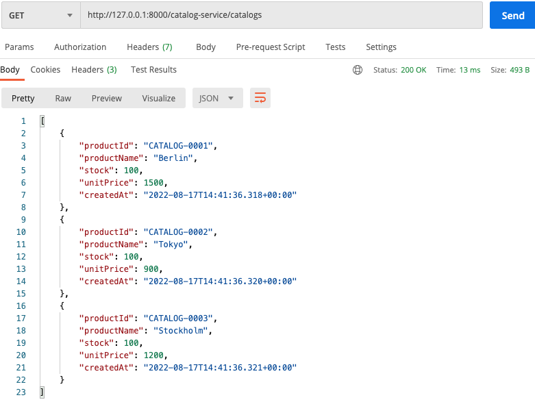 

order-service 에서 'CATALOG-0003' 상품을 23개 주문. 

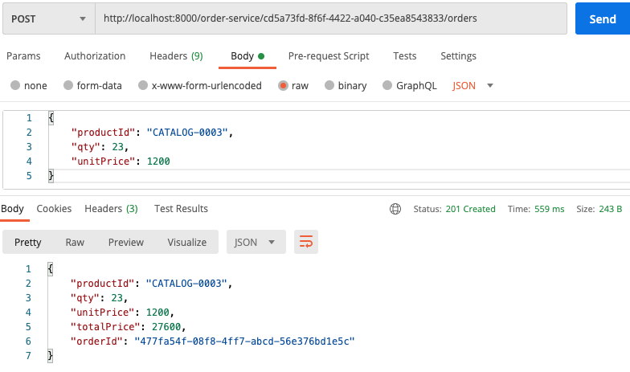 

(주문 후 order-service 로그) 

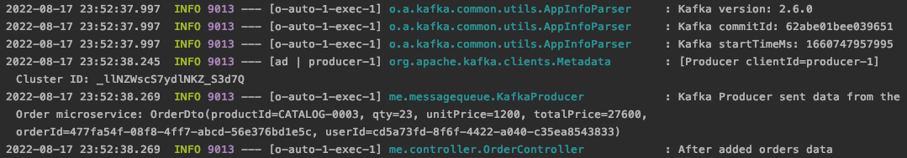 

(catalog-service 로그) 

 

다시 catalog-service 에서 상품 리스트를 조회하면 'CATALOG-0003' 수량이 변경된 것을 확인할 수 있다. 

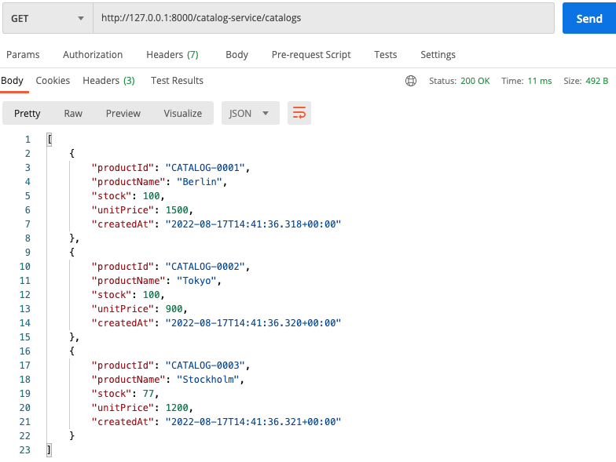 
  

## Kafka Connector + 단일 DB 사용 
Multiple Orders Service 해결 방법 중 Kafka Connector 와 단일 DB를 사용하는 방법이다.  
우선 Multiple Orders Service 문제를 직접 확인해 보면..  

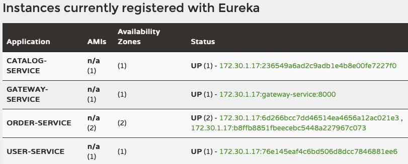 

위와 같이 order-service 를 2개 기동했을 때, 상품 주문을 하게 되면..  

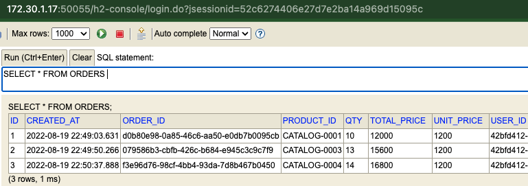 

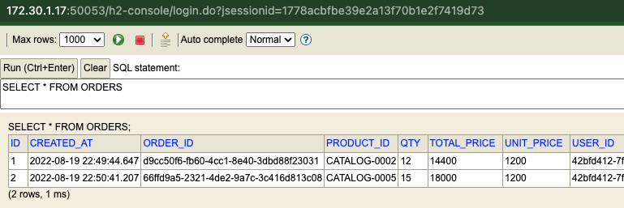 

2개의 order-service 가 다른 DB를 사용하고 있기 때문에  
주문을 할 때마다 주문 정보가 경우에 따라 2개의 다른 DB에 번갈아가면서 저장되게 된다.  

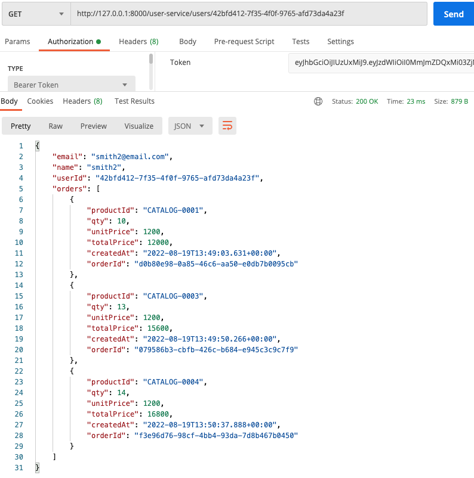 

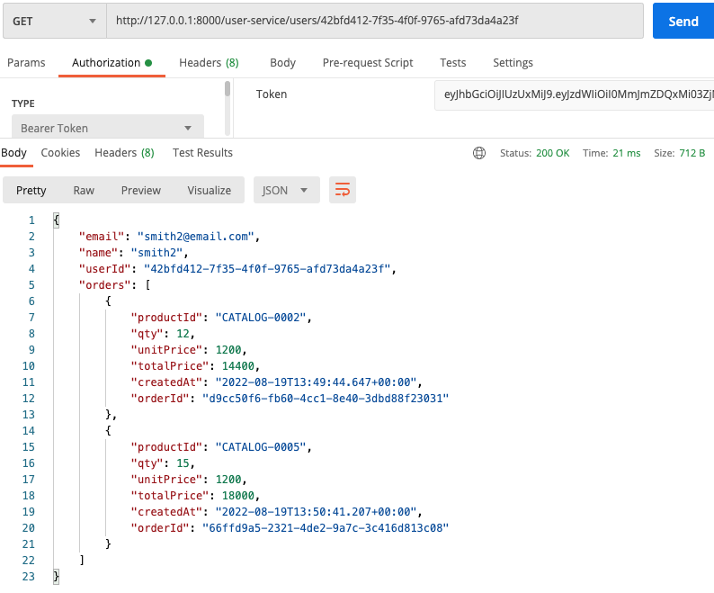 

때문에 주문 정보를 조회할 때에도 위와 같이 어떤 경우에는 2개, 어떤 경우에는 3개로  
주문 정보를 조회할 때마다 매번 결과가 다르게 조회되는 현상이 발생한다.  

### 해결 방법 
- 2개의 order-service 에 요청된 주문 정보를 Kafka Topic 으로 전송. 
- Kafka Topic 에 설정된 Kafka Sink Connect 를 사용하여 단일 DB 에 저장. (데이터 동기화) 
    - (Kafka 에서 순차적으로 가지고 있다가 DB로 전달하는 역할을 한다.)
 

우선 테스트를 위해서 기존에 order-service 에서 사용하고 있던 H2 DB를 MySQL로 변경한다.  

 

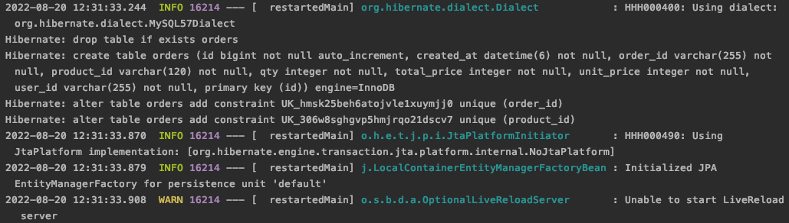 

그리고 order-service 로 상품 주문 시 Topic 으로 메시지를 보내도록 아래와 같이 추가한다.  

#### [OrderController.java]
~~~
@RestController
@RequestMapping("/order-service")
@Slf4j
public class OrderController {
    @PostMapping("/{userId}/orders")
    public ResponseEntity<ResponseOrder> createOrder(@PathVariable("userId") String userId,
                                                     @RequestBody RequestOrder orderDetails) {
        /* kafka */
        orderDto.setOrderId(UUID.randomUUID().toString());
        orderDto.setTotalPrice(orderDetails.getQty() * orderDetails.getUnitPrice());

        /* send this order to the kafka */
        ... 
        orderProducer.send("orders", orderDto);
        ... 
    }
}
~~~
#### [OrderProducer.java]
~~~
@Service
@Slf4j
public class OrderProducer {
    ... 
    public OrderDto send(String topic, OrderDto orderDto) {
        ...
        KafkaOrderDto kafkaOrderDto = new KafkaOrderDto(schema, payload);
        ...
        kafkaTemplate.send(topic, jsonInString);
        ... 
    }
}
~~~
이 외 OrderProducer.java 에서 Topic 에 전달할 메시지를 담을 때 사용할  
[Field.java], [Schema.java], [Payload.java], [KafkaOrderDto.java] 와 같은 DTO 들을 추가.  
#### [Kafka Sink Connect 등록]
~~~
echo '
{
    "name":"my-order-sink-connect",
    "config":{
        "connector.class":"io.confluent.connect.jdbc.JdbcSinkConnector", // DB 연결용 Sink Connector를 사용.
        "connection.url":"jdbc:mysql://localhost:3306/mydb",
        "connection.user":"root",
        "connection.password":"패스워드",
        "auto.create":"true",           
        "auto.evolve":"true",
        "delete.enabled":"false",
        "tasks.max":"1",
        "topics":"orders" // Topic 이름. 
    }
}
'| curl -X POST -d @- http://localhost:8083/connectors --header "content-Type:application/json"
~~~
#### [테스트 결과]
상품 주문을 하면 요청을 보낼 때마다 OrderProducer 에서 주문 정보를 메시지로 만들어서  
Topic 으로 전달하는 로그를 확인할 수 있다. 

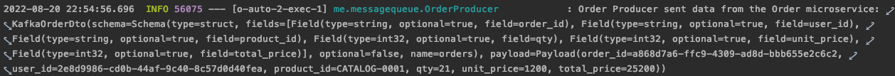 

그리고 아래와 같이 콘솔로 Consumer 에서 받는 메시지도 확인할 수 있다.  

~~~
$KAFKA_HOME/bin/kafka-console-consumer.sh --bootstrap-server localhost:9092 --topic orders --from-beginning
~~~
 

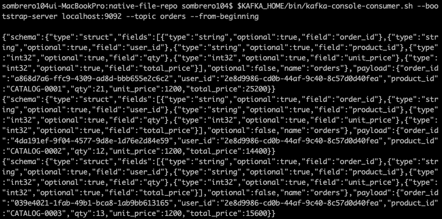 

마지막으로 DB에서 주문 내역을 조회해 보면 단일 DB에 모든 주문 정보가 순차적으로 저장된 것을 확인할 수 있다.  

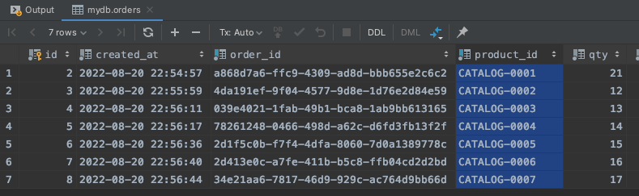 

    
